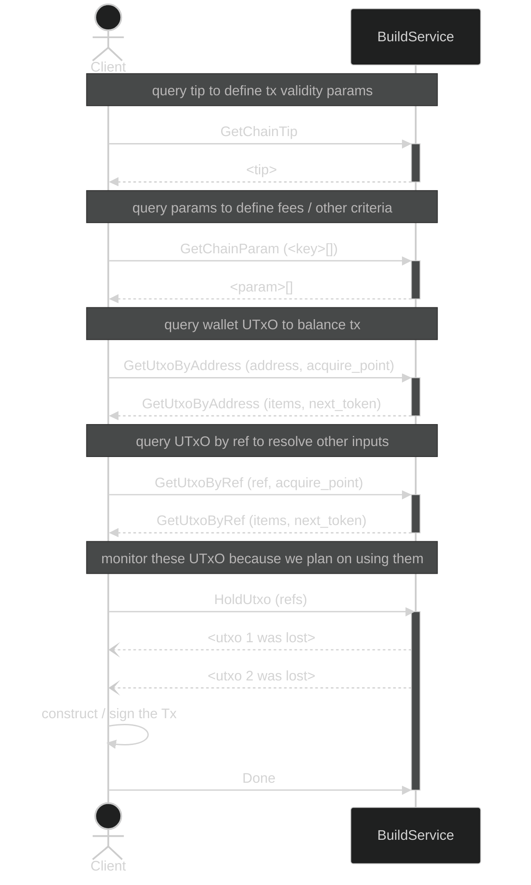

import { Callout } from "nextra-theme-docs";

# Build Module

The _Build_ module provides an interface for querying the state of the ledger and constructing transactions.

## Operations

- `GetChainTip`: This method retrieves the current chain tip, which represents the latest state of the blockchain.
- `GetChainParam`: This method allows clients to request specific chain parameters, providing essential information for transaction construction and validation.
- `GetUtxoByAddress`: This method enables clients to query UTxOs associated with a list of addresses at a specific point in the chain.
- `GetUtxoByRef`: This method allows clients to fetch UTxOs based on their references, which includes the transaction hash and output index, at a specific point in the chain.
- `HoldUtxo`: This method enables clients to hold UTxOs, preventing them from being spent, and receive updates about lost UTxOs in a streaming fashion.

<Callout type="info">
  The schema details can be found in the [spec reference](spec).
</Callout>

## Sequence Example

