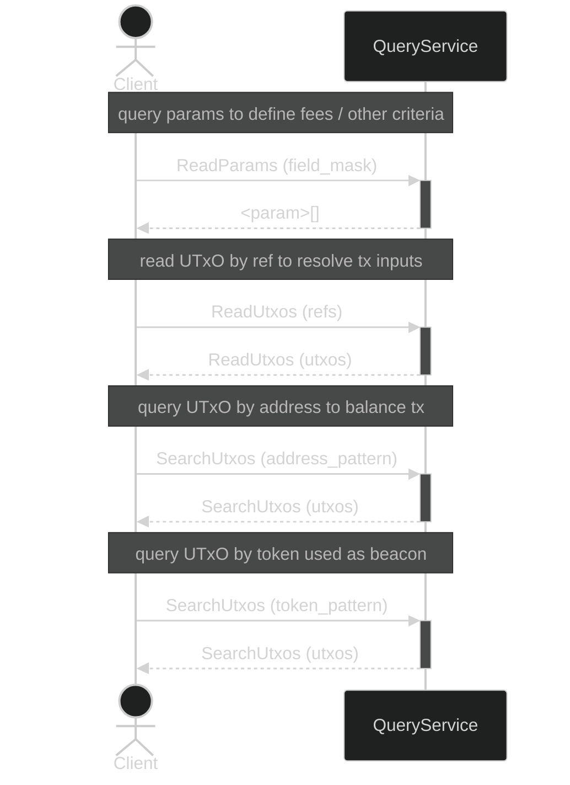

import { Callout } from "nextra-theme-docs";

# Query Module

The _Query_ module provides an interface for querying the state of the ledger with the main goal of constructing new transactions.

## Operations

- `ReadParams`: Read chain-wide parameters. 
- `ReadUtxos`: Read specific UTxOs by reference. 
- `SearchUtxos`: Search for UTxO based on a pattern. 
- `ReadData`: Read specific data (plural of datum) by hash.

<Callout type="info">
  The schema details can be found in the [spec reference](spec).
</Callout>

## Sequence Example

