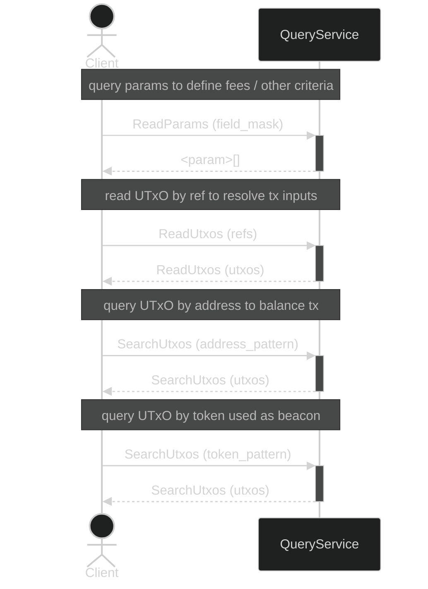

import { Callout } from "nextra-theme-docs";
import { Tabs, Tab } from 'nextra-theme-docs'


# Query Module

The _Query_ module provides an interface for querying the state of the ledger with the main goal of constructing new transactions.

## Operations

<Callout type="info">
  **Important**: All byte fields in grpcurl examples (like hashes, addresses, assets) must be base64 encoded.
</Callout>

<Callout type="note">
    The following code samples assume that the UTxORPC node is running locally on `localhost:50051`. If your node is hosted remotely or on a different server, replace `"http://localhost:50051"` with the appropriate server URL and port for your environment. 
    
    For more details on configuring your node, refer to the [UTxORPC Ecosystem Servers Documentation](/servers).
</Callout>

### ReadParams
Retrieves the current protocol parameters for the chain, including important values like fees, epoch information, and other consensus settings.

<Tabs items={['grpcurl']}>
  <Tab>
    ```bash
    grpcurl -plaintext \
      localhost:50051 \
      utxorpc.v1alpha.query.QueryService.ReadParams
    ```
  </Tab>
</Tabs>

### ReadUtxos 
Fetches specific UTXOs by their transaction reference (hash and index). Useful when you need to look up known UTXOs directly.

<Tabs items={['grpcurl']}>
  <Tab>
    ```bash
    grpcurl -plaintext \
      -d '{
        "keys": [{
          "hash": "p4WAOb31UfCR2qsqVlBLiUrsVwZoGPVOmYOjavDuEPs=",
          "index": 0
        }]
      }' \
      localhost:50051 \
      utxorpc.v1alpha.query.QueryService.ReadUtxos
    ```
  </Tab>
</Tabs>

### SearchUtxos
Search for UTXOs using various filtering patterns. The following search methods are available:

#### By Address
Search for all UTXOs controlled by a specific Cardano address. The address must be base64 encoded.

<Tabs items={['grpcurl']}>
  <Tab>
    ```bash
    grpcurl -plaintext \
      -d '{
        "predicate": {
          "match": {
            "cardano": {
              "address": {
                "exact_address": "AJs7DC2gQcMrCyDdI49iEvCVlVjxfyrYvmj76rLmODCCS9vyMxgygxirZgrESIt1j2tbOSqOku8e"
              }
            }
          }
        }
      }' \
      localhost:50051 \
      utxorpc.v1alpha.query.QueryService.SearchUtxos
    ```
  </Tab>
</Tabs>

#### By Address Payment Part 
Search for UTXOs by just the payment credential part of an address. Useful when you want to find UTXOs regardless of stake credential.

<Tabs items={['grpcurl']}>
  <Tab>
    ```bash
    grpcurl -plaintext \
      -d '{
        "predicate": {
          "match": {
            "cardano": {
              "address": {
                "payment_part": "mzsMLaBBwysLIN0jj2IS8JWVWPF/Kti+aPvqsg=="
              }
            }
          }
        }
      }' \
      localhost:50051 \
      utxorpc.v1alpha.query.QueryService.SearchUtxos
    ```
  </Tab>
</Tabs>

#### By Address Delegation Part
Search for UTXOs by just the stake credential (delegation part) of an address. Helps find all UTXOs delegated to a specific stake key.

<Tabs items={['grpcurl']}>
  <Tab>
    ```bash
    grpcurl -plaintext \
      -d '{
        "predicate": {
          "match": {
            "cardano": {
                "address": {
                    "delegation_part": "5jgwgkvb8jMYMoMYq2YKxEiLdY9rWzkqjpLvHg=="
                }
            }
          }
        }
      }' \
      localhost:50051 \
      utxorpc.v1alpha.query.QueryService.SearchUtxos
    ```
  </Tab>
</Tabs>

#### By Asset Policy
Search for UTXOs containing tokens from a specific policy ID. The policy ID must be base64 encoded.

<Tabs items={['grpcurl']}>
  <Tab>
    ```bash
    grpcurl -plaintext \
      -d '{
        "predicate": {
          "match": {
            "cardano": {
              "asset": {
                "policy_id": "BH4PkSxCYP5mriceWuSU3NX3ljW7uxOGvhlfTg=="
              }
            }
          }
        }
      }' \
      localhost:50051 \
      utxorpc.v1alpha.query.QueryService.SearchUtxos
    ```
  </Tab>
</Tabs>

#### By Specific Asset 
Search for UTXOs containing a specific token, identified by both policy ID and asset name (combined and base64 encoded).

<Tabs items={['grpcurl']}>
  <Tab>
    ```bash
    grpcurl -plaintext \
      -d '{
        "predicate": {
          "match": {
            "cardano": {
              "asset": {
                "asset_name": "BH4PkSxCYP5mriceWuSU3NX3ljW7uxOGvhlfTkFMTEVZS0FUWjAwMDYw"
              }
            }
          }
        }
      }' \
      localhost:50051 \
      utxorpc.v1alpha.query.QueryService.SearchUtxos
    ```
  </Tab>
</Tabs>

### ReadData 
Read specific data (plural of datum) by hash.
<Callout type="warning">
  This operation is yet to be implemented in Dolos and is still getting worked on.
</Callout>
<Tabs items={['grpcurl']}>
  <Tab>
    ```bash
    grpcurl -plaintext \
      -d '{
        "keys": [
          "/u066600mYdRq1Xjf3d1UOSguQ8umzvtplb6DymjDeA="
        ]
      }' \
      localhost:50051 \
      utxorpc.v1alpha.query.QueryService.ReadData
    ```
  </Tab>
</Tabs>


<Callout type="info">
  The schema details can be found in the [spec reference](spec).
</Callout>

## Sequence Example


