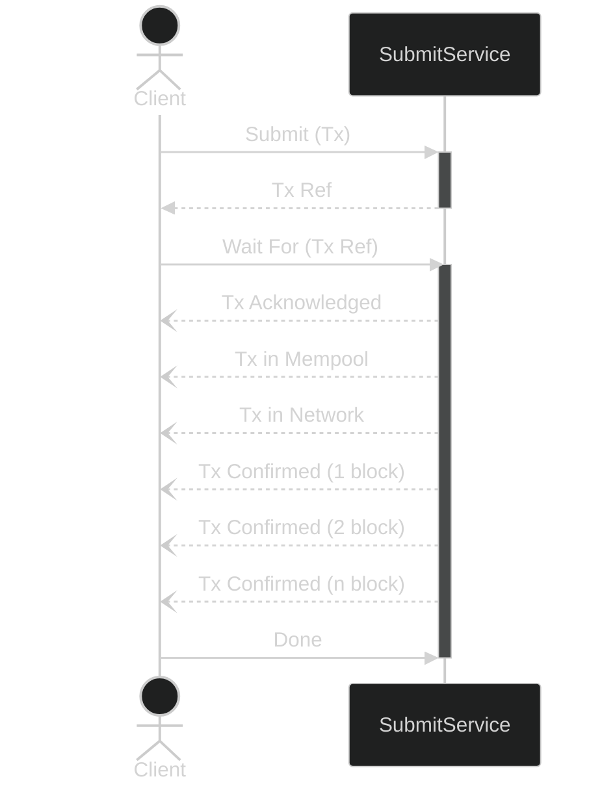

import { Callout } from "nextra-theme-docs";
import { Tabs, Tab } from 'nextra-theme-docs'

# Submit Module

The _Submit_ module provides an interface for submitting transactions and monitoring their progress through various stages in their lifecycle.

## Sequence Example

The following diagram describes the message exchange between a client and service where the client submits a transaction and waits for status updates asynchrounously.



## Operations

<Callout type="info">
  **Important**: All byte fields in grpcurl examples (like hashes, addresses, assets) must be base64 encoded.
  For more details and installation of grpcurl, refer to the [grpcurl guide](/grpcurl).
</Callout>

<Callout type="note">
    The following code samples assume that the UTxORPC node is running locally on `localhost:50051`. If your node is hosted remotely or on a different server, replace `"http://localhost:50051"` with the appropriate server URL and port for your environment. 
    
    For more details on configuring your node, refer to the [UTxORPC Ecosystem Servers Documentation](/servers).
</Callout>
### SubmitTx
Submit transactions to the blockchain. Fire-and-forget operation that returns immediately after transaction acknowledgment.

<Tabs items={['grpcurl']}>
  <Tab>
    ```bash
    grpcurl -plaintext \
      -d '{
        "tx": [{
          "raw": "hKMA2QECgYJYIIr32cljAfWKdI46b+X1FYDwg/KjDyDlWeLUYX2+unxaAAGBglgdYDPDeM7kGy4VrISPf28dL3gVWrEtk7cT3omNhV8bAAAAASoDX08CGgACkrGhANkBAoGCWCB0Y+GprLDXD5tlL/LBJfX7zyKIr7u8HjEy/hjKy/26L1hArvC+2bA1w/+/EKy078bNBZqdpJ6uwZfYvTdwYY/V4ErLZgcRiynr/zA64CuVWGxQN2vGiP3W1tBnfuOCaApfAvX2"
        }]
      }' \
      localhost:50051 \
      utxorpc.v1alpha.submit.SubmitService.SubmitTx
    ```
  </Tab>
</Tabs>

### WatchMempool
Streams real-time updates about transactions in the mempool that match specified patterns. Useful for monitoring pending transactions matching certain criteria.

#### By Address
Watch mempool by a specific Cardano address. The address must be base64 encoded.

<Tabs items={['grpcurl']}>
  <Tab>
    ```bash
    grpcurl -plaintext \
      -d '{
        "predicate": {
          "match": {
            "cardano": {
              "has_address": {
                "exact_address": "AJs7DC2gQcMrCyDdI49iEvCVlVjxfyrYvmj76rLmODCCS9vyMxgygxirZgrESIt1j2tbOSqOku8e"
              }
            }
          }
        }
      }' \
      localhost:50051 \
      utxorpc.v1alpha.submit.SubmitService.WatchMempool
    ```
  </Tab>
</Tabs>

#### By Address Payment Part
Watch mempool by just the payment credential part of an address. Useful when you want to watcb mempool regardless of stake credential.

<Tabs items={['grpcurl']}>
  <Tab>
    ```bash
    grpcurl -plaintext \
      -d '{
        "predicate": {
          "match": {
            "cardano": {
              "has_address": {
                "payment_part": "mzsMLaBBwysLIN0jj2IS8JWVWPF/Kti+aPvqsg=="
              }
            }
          }
        }
      }' \
      localhost:50051 \
      utxorpc.v1alpha.submit.SubmitService.WatchMempool
    ```
  </Tab>
</Tabs>

#### By Address Delegation Part
Watch mempool by just the stake credential (delegation part) of an address. 

<Tabs items={['grpcurl']}>
  <Tab>
    ```bash
    grpcurl -plaintext \
      -d '{
        "predicate": {
          "match": {
            "cardano": {
              "has_address": {
                "delegation_part": "5jgwgkvb8jMYMoMYq2YKxEiLdY9rWzkqjpLvHg=="
              }
            }
          }
        }
      }' \
      localhost:50051 \
      utxorpc.v1alpha.submit.SubmitService.WatchMempool
    ```
  </Tab>
</Tabs>

#### By Asset Policy
Watch mempool for UTxOs containing tokens from a specific policy ID. The policy ID must be base64 encoded.

<Tabs items={['grpcurl']}>
  <Tab>
    ```bash
    grpcurl -plaintext \
      -d '{
        "predicate": {
          "match": {
            "cardano": {
              "moves_asset": {
                "policy_id": "pDQq5fQKGM5sGXdgHjY8zDDKiBH4YpMeOpV8vmA="
              }
            }
          }
        }
      }' \
      localhost:50051 \
      utxorpc.v1alpha.submit.SubmitService.WatchMempool
    ```
  </Tab>
</Tabs>

#### By Specific Asset
Watch mempool for UTxOs containing a specific token, identified by both policy ID and asset name (combined and base64 encoded).

<Tabs items={['grpcurl']}>
  <Tab>
    ```bash
    grpcurl -plaintext \
      -d '{
        "predicate": {
          "match": {
            "cardano": {
              "moves_asset": {
                "asset_name": "BH4PkSxCYP5mriceWuSU3NX3ljW7uxOGvhlfTkFMTEVZS0FUWjAwMDYw"
              }
            }
          }
        }
      }' \
      localhost:50051 \
      utxorpc.v1alpha.submit.SubmitService.WatchMempool
    ```
  </Tab>
</Tabs>

### WaitForTx
Wait for transactions to reach specific stages and receive asynchronous updates.

<Tabs items={['grpcurl']}>
  <Tab>
    ```bash
    grpcurl -plaintext \
      -d '{ 
        "ref": ["43Ohebmol5p9Zeal+nVCxzw7nA40nzKpkXfIfSRPy1k="]
      }' \
      localhost:50051 \
      utxorpc.v1alpha.submit.SubmitService.WaitForTx
    ```
  </Tab>
</Tabs>

### EvalTx
Evaluate transactions before submission to verify their validity and estimate execution costs.
<Callout type="warning">
  This operation is still unstable and is still undergoing further testing.
</Callout>
<Tabs items={['grpcurl']}>
  <Tab>
    ```bash
    grpcurl --plaintext -d '                                             
      {
        "tx": [
          {
            "raw": "hKgA2QECgYJYIMOTiVfum0ZmZahbG/uyWeVIDlMPHMzMLkD3sJQuMYqXAA3ZAQKBglggw5OJV+6bRmZlqFsb+7JZ5UgOUw8czMwuQPewlC4xipcBEtkBAoGCWCB5bJp9330oJCXPwEUCy/av6qS6hNesV7iYr10RlxqQTwABgYJYHWD0AwQPh9IKl7sWw8wLSb0FeFDhwfYer5xtnruNGgBJkDcQglgdYPQDBA+H0gqXuxbDzAtJvQV4UOHB9h6vnG2eu40aAEgyshEaAAQYjgIaAAK7CQtYIHuJIOi90SACSoYtSz8Eq7tFVTtj6vLUQRDXBMG7O5cPoQWhggAAgth5nxgq/4IZKG8aACzAsfX2"
          }
        ]
      }
      ' \
      -H 'content-type: application/grpc' \
      localhost:50051 \
      utxorpc.v1alpha.submit.SubmitService.EvalTx
    ```
  </Tab>
</Tabs>

### ReadMempool
Query the current state of the mempool to check status of pending transactions.

<Callout type="warning">
  This operation is currently under development in Dolos and is not yet available.
</Callout>

<Tabs items={['grpcurl']}>
  <Tab>
    ```bash
    grpcurl -plaintext \
      -d '{}' \
      localhost:50051 \
      utxorpc.v1alpha.submit.SubmitService.ReadMempool
    ```
  </Tab>
</Tabs>

<Callout type="info">
  The schema details can be found in the [spec reference](spec).
</Callout>