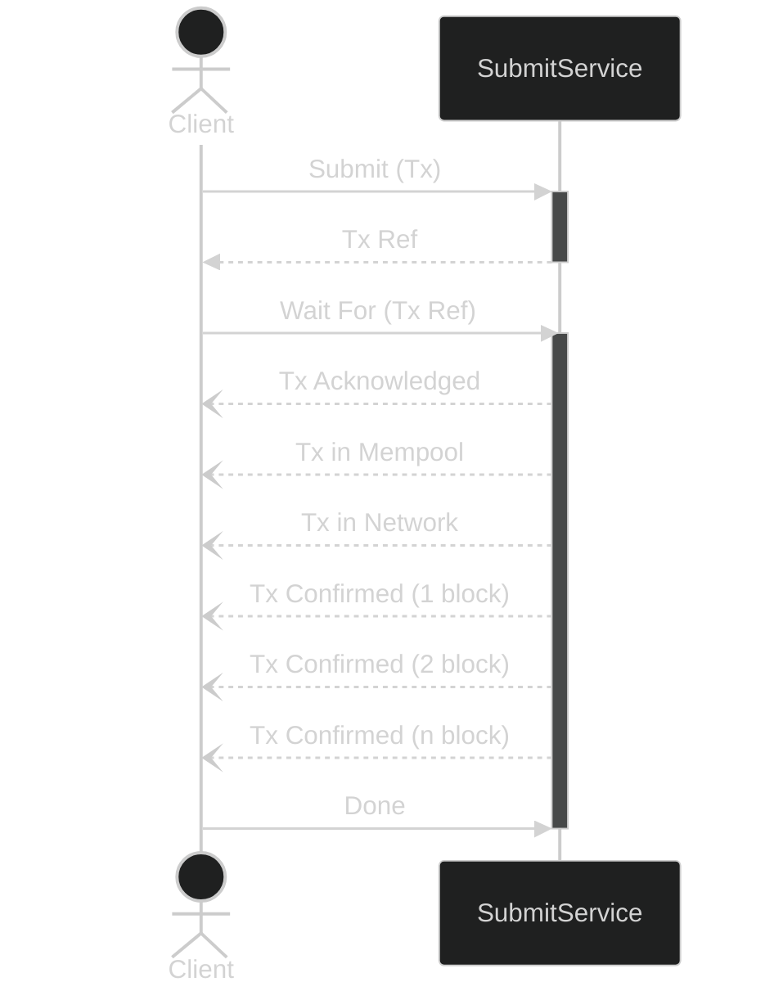

import { Callout } from "nextra-theme-docs";

# Submit Module

The _Submit_ module provides an interface for submitting transactions and monitoring their progress through various stages in their lifecycle.

## Operations

- `Submit`: This method allows clients to submit transactions to the blockchain. It's fire-and-forget, the service will return inmediately once the transaction is acknowledged.
- `Check`: This method allows clients to check the status of submitted transactions in a synchronous fashion. The operation is blocking but it will return inmediatelly with the latest known status for the transaction.
- `WaitFor`: This method allows clients to wait for transactions to reach a certain stage and receive updates in an asynchrounous fashion. The client starts a stream to watch specific transaction, the service will post reply each time a stage change occurs.

<Callout type="info">
  The schema details can be found in the [spec reference](spec).
</Callout>

## Sequence Example

The following diagram describes the message exchange between a client and service where the client submits a transaction and waits for status updates asynchrounously.

