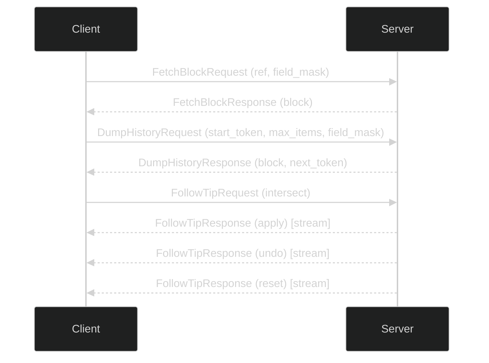

import { Callout } from "nextra-theme-docs";

# Sync Module

The _Sync_ module provides an interface for synchronizing chain data, fetching blocks, and tracking the tip of the blockchain.

## Operations

- `FetchBlock`: This method enables clients to fetch blocks by their references. Clients can selectively return fields using a field mask.
- `DumpHistory`: This method allows clients to dump a segment of the block history, starting from a specified point and up to a maximum number of items. Clients can selectively return fields using a field mask.
- `FollowTip`: This method enables clients to follow the tip of the blockchain by finding the intersection with a list of block references. The service will stream updates, including applying and undoing blocks or resetting to a specific block reference.

<Callout type="info">
  The schema details can be found in the [spec reference](spec).
</Callout>

## Sequence Example

