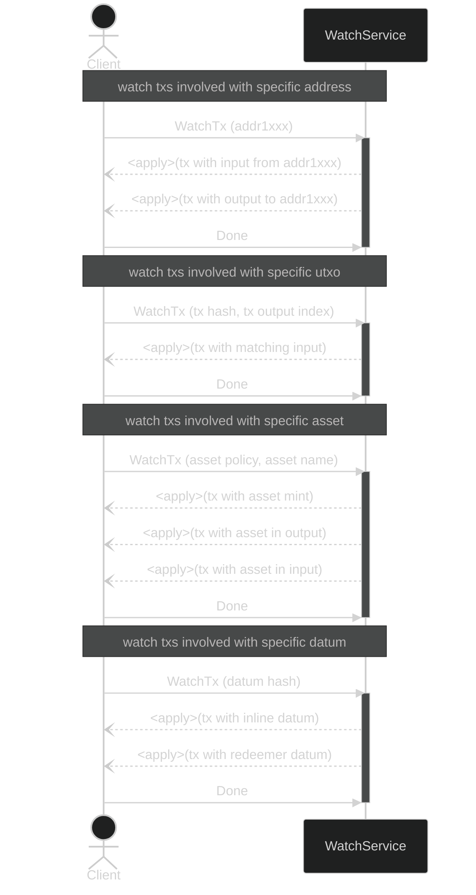

import { Callout } from "nextra-theme-docs";

# Watch Module

The _Watch_ module provides an interface for streaming transactions based on specified predicates, allowing clients to monitor specific aspects of the blockchain.

## Operations

- `WatchTx`: This method enables clients to stream transactions matching a set of predicates, such as addresses, assets, UTXOs, or datums. The service will stream updates, including applying and undoing transactions. Clients can selectively return fields using a field mask.

<Callout type="info">
  The schema details can be found in the [spec reference](spec).
</Callout>

## Sequence Example

